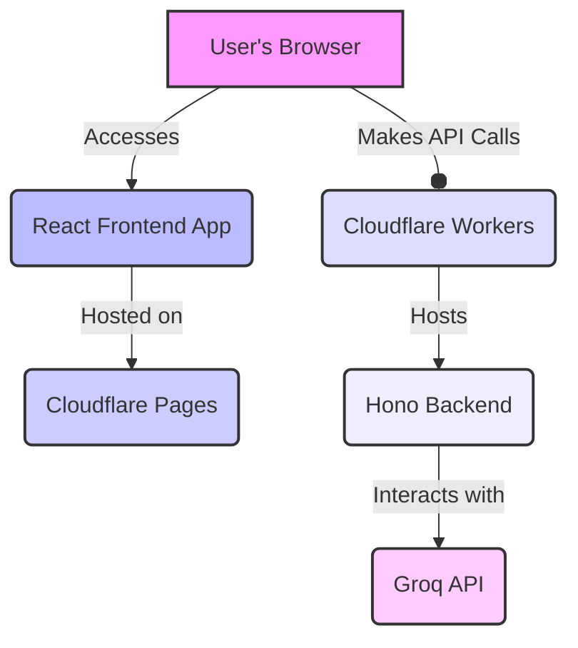

# GenAI ChatApp

This repository contains the full-stack code for the **GenAI ChatApp**, a simple AI Chat application featuring a React frontend hosted on Cloudflare Pages and a serverless Hono backend running on Cloudflare Workers. This project is designed for high performance and scalability, leveraging Cloudflare's edge network capabilities and Groq's fast inference engine.

## 🚀 Features

* **React Frontend:** A modern, interactive user interface built with React (Vite + TypeScript).
* **Hono Backend:** A lightweight and fast serverless API written in TypeScript using Hono, deployed on Cloudflare Workers.
* **Cloudflare Pages Hosting:** Frontend assets are deployed globally via Cloudflare's CDN for fast loading times.
* **Cloudflare Workers Edge Compute:** Backend API runs at the edge, close to users, for low latency.
* **Dynamic CORS Handling:** Robust CORS configuration that automatically allows origins from Cloudflare Pages deployments (including preview URLs) and local development.
* **Groq API Integration:** The `/chat` endpoint is set up to interact with the Groq API for incredibly fast AI responses.
* **Shared Types:** Common TypeScript types defined in a central `types/` directory for consistency between frontend and backend.

## 🏗️ Architecture

The project follows a standard decoupled frontend/backend architecture, optimized for Cloudflare's ecosystem:



## 📂 Project Structure

```
genai-chatapp-project/
├── frontend/                     # React (Vite + TS) UI
│   ├── public/
│   ├── src/
│   │   ├── assets/
│   │   ├── components/
│   │   ├── hooks/
│   │   ├── pages/
│   │   ├── App.tsx
│   │   ├── index.css
│   │   ├── main.tsx
│   │   └── vite-env.d.ts
│   ├── exampleEnv
│   ├── .env.local               # Local environment variables for frontend
│   ├── index.html
│   ├── package.json
│   ├── tsconfig.json
│   ├── tsconfig.app.json
│   ├── tsconfig.node.json
│   └── vite.config.ts
├── backend/
│   ├── cloudflare-worker/        # Cloudflare Worker specific code & config
│   │   ├── src/
│   │   │   ├── index.ts          # CF Worker entry point
│   │   │   ├── routes/chat.ts    # Chat API routes
│   │   │   ├── api/groq.ts       # Groq API integration logic
│   │   │   └── utils/rateLimit.ts # Utility for rate limiting (example)
│   │   ├── wrangler.jsonc        # Worker configuration file (replaces wrangler.toml)
│   │   ├── .gitignore
│   │   ├── package.json
│   │   ├── package-lock.json
│   │   ├── tsconfig.json         # TS config for Cloudflare Worker
│   │   ├── .dev.vars             # Local environment variables for Cloudflare Worker (wrangler dev)
│   │   └── node_modules/
│   ├── deno-deploy/              # Deno Deploy specific code & config (empty for now, for future expansion)
│   │   ├── src/
│   │   └── ...
├── shared/
│   └── types/
│       └── index.ts                 # SHARED TYPES (e.g., ChatMessage interface)
├── README.md
├── .gitignore
└── # No root package.json for now (each sub-project manages its own dependencies)
```


## ⚙️ Technologies Used

### Frontend

- **React:** Frontend library
- **Vite:** Build tool for fast development and bundling
- **TypeScript:** For type safety
- **NPM/Yarn:** Package manager

### Backend
- **Hono:** Ultra-fast web framework for edge runtimes
- **TypeScript:** Language for backend development
- **Cloudflare Workers:** Serverless edge compute platform (worker name: genai-chatapp)
- **Wrangler:** Cloudflare's CLI tool for Workers development and deployment
- **Groq API:** For AI model inference

## 🚀 Getting Started
Follow these steps to set up and run the project locally.

**Prerequisites**
- Node.js (LTS version recommended)
- npm or Yarn
- Cloudflare Account (for deployment)
- Cloudflare Wrangler CLI (npm i -g wrangler)
- Groq API Key (get one from Groq Console)

### 1. **Clone the Repository**

```Bash
git clone <your-repo-url>
cd genai-chatapp-project/
```

### 2. **Backend Setup (backend/cloudflare-worker)**

Navigate to the Cloudflare Worker directory.

```bash
cd backend/cloudflare-worker
npm install # or yarn install
```

**Configure Environment Variables for Local Development:**
Create a `.dev.vars` file in the `backend/cloudflare-worker directory.` This file is automatically loaded by `wrangler dev` and is not committed to Git.

```Ini, TOML
# backend/cloudflare-worker/.dev.vars
ALLOWED_ORIGIN="http://localhost:5173"
GROQ_API_KEY="your_local_groq_api_key" # Replace with your actual Groq API Key for local testing
```

**Important:** `.dev.vars` is for local development only. For production deployments to Cloudflare Workers, you must configure environment variables directly in the Cloudflare Dashboard or using `wrangler secret`.

**Run the Backend Locally:**

```bash
npm run dev # If set in cloudflare-workers/package.json
# OR
npx wrangler dev
```

The backend (worker `genai-chatapp`) should now be running locally on `http://localhost:8787` (or another port if configured in `wrangler.jsonc`). Check your console for the exact URL.


### 3. **Frontend Setup (**`frontend`**)**

Navigate to the frontend directory.

```bash
cd ../../frontend # Go up two levels from cloudflare-worker to genai-chatapp-project/frontend
npm install
```

**Configure Backend URL:**

Create a `.env.local` file in the `frontend/` directory. This file is used by Vite for local environment variables and is typically ignored by Git.

```Ini, TOML
# frontend/.env.local
VITE_API_BASE_URL=http://localhost:8787
```

**Run the Frontend Locally:**

```bash
npm run dev
```

The frontend should now be running on `http://localhost:5173` (or another port). Open your browser to this URL.

### 4. **Deploying to Cloudflare**

**Deploying the Frontend (Cloudflare Pages)**
  1. Push your frontend/ code to a Git repository (e.g., GitHub).
  1. Go to your Cloudflare Dashboard.
  1. Navigate to **Pages** and click "Create a project".
  1. Connect your Git repository. When configuring the build, ensure the "Build command" and "Output directory" are correct for your Vite app (e.g., `npm run build` and `dist`). Cloudflare Pages will automatically build and deploy your React app.
  1. **Set Environment Variable in Pages:** If your frontend needs to know the production backend URL, configure `VITE_API_BASE_URL` in your Cloudflare Pages project settings (Environment variables section). This should be the URL of your deployed Cloudflare Worker (e.g., `https://genai-chatapp`.<your-username>.workers.dev).

  **Deploying the Backend (Cloudflare Workers)**
  1. Make sure you are in the `backend/cloudflare-worker` directory.
  1. Deploy your Worker (`genai-chatapp`):
      ```bash
      npm run deploy # If set in your cloudflare-worker/package.json
      # or
      npx wrangler deploy
      ```
      Wrangler will guide you through the deployment process. It will publish your Worker to a URL like `https://genai-chatapp.<your-username>.workers.dev`.
  
**Important for Production Deployment (Cloudflare Dashboard):**
- **Worker Environment Variables:** After deploying, go to your Cloudflare Dashboard -> Workers & Pages -> Your Worker (`genai-chatapp`) -> Settings -> Variables.
  - Set `ALLOWED_ORIGIN` (as an environment variable): This should include your Cloudflare Pages production URL (e.g., `https://your-pages-app.pages.dev`) and any preview URLs (`https://<git-branch>.your-pages-app.pages.dev`) you want to allow. Multiple origins can be comma-separated.
  Example: `ALLOWED_ORIGIN = https://your-pages-app.pages.dev,https://preview-branch.your-pages-app.pages.dev`
- Securely store `GROQ_API_KEY` **as a Secret:**
  ```bash
  npx wrangler secret put GROQ_API_KEY
  ```
  This command will prompt you to enter the secret value and securely upload it to Cloudflare. Your Worker code will then access it via `env.GROQ_API_KEY`.

## 🐛 Debugging CORS Issues

This project includes robust CORS handling, but here's a quick guide if you encounter issues:

The common error "Access to fetch at '...' from origin '...' has been blocked by CORS policy: Response to preflight request doesn't pass access control check: No 'Access-Control-Allow-Origin' header is present on the requested resource." usually indicates a mismatch in origin strings for the `OPTIONS` preflight request.

**The Fix Implemented**
The backend (in `backend/cloudflare-worker/src/index.ts`) now explicitly **normalizes incoming** `Origin` **headers and configured** `ALLOWED_ORIGIN` **values**. This involves:
1. Trimming whitespace.
1. Removing any trailing slashes (/).

This ensures that `http://localhost:5173` matches `http://localhost:5173/` and `https://your-pages-app.pages.dev` matches `https://your-pages-app.pages.dev/`, preventing common comparison failures for dynamic Cloudflare Pages URLs.

**Debugging Steps:**

1. **Check** `wrangler dev` **console logs:** When running locally, the backend has extensive `console.log` statements (e.g., `[PREFLIGHT CHECK]`) that show the incoming `Origin` header (raw and normalized) and the `Configured Allowed Origins`. Verify that `Is Incoming Origin Allowed by Config? `is `true` for your frontend's origin.
1. **Browser Network Tab:** Open your browser's developer tools (F12) and go to the "Network" tab.
    - Locate the `OPTIONS` preflight request to your backend (`http://localhost:8787/chat` or your deployed Worker URL).
    - Inspect its `Response Headers`. It _must_ have `Access-Control-Allow-Origin` set to your frontend's exact origin.
    - The HTTP status code for a successful preflight should be `204 No Content`.

## 🙏 Acknowledgements
* [Hono](https://hono.dev/) for the fast web framework.
* [Cloudflare Workers](https://workers.cloudflare.com/) for the powerful serverless platform.
* [Cloudflare Pages](https://pages.cloudflare.com/) for effortless frontend deployment.
* [Groq](https://groq.com/) for the incredibly fast inference engine.


